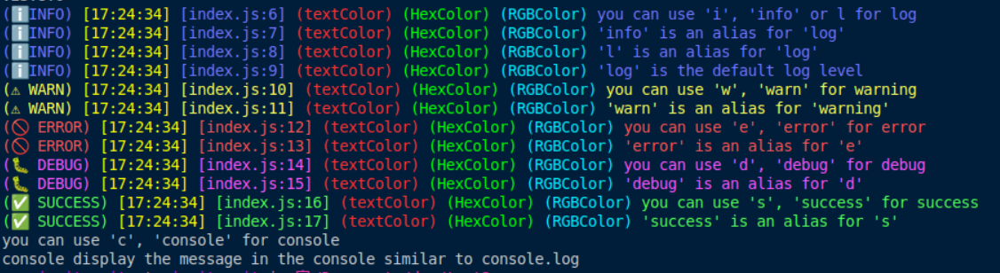

# mi-log

**mi-log** is a lightweight and customizable logging library for Node.js. It provides different log levels, colorized output, and easy-to-use methods to enhance debugging and monitoring.

## Installation

Install **mi-log** using npm:

```sh
npm install mi-log
```

## Migration from v2 to v3

In version 3 of **mi-log**, the way you import the library has changed. If you were using version 2, update your imports:

### Before (v2)
```js
const MiniLog = require('mi-log');
```

### After (v3)
```js
const MiniLog = require('mi-log/miniLog');
```

This change ensures that only the **MiniLog** module is loaded, improving performance and modularity.

## Usage

Import **mi-log** and initialize a logger instance:

```js
const MiniLog = require('mi-log/miniLog'); // or require('mi-log').miniLog

const log = new MiniLog([
    { text: "textColor", color: "red" },
    { text: "HexColor", color: "#00FF00" },
    { text: "RGBColor", color: "rgb(0, 238, 255)" }
]);

log.i("You can use 'i', 'info' or 'l' for logging");
log.info("'info' is an alias for 'log'");
log.l("'l' is an alias for 'log'");
log.log("'log' is the default log level");
log.w("You can use 'w', 'warn' for warnings");
log.warn("'warn' is an alias for 'warning'");
log.e("You can use 'e', 'error' for errors");
log.error("'error' is an alias for 'e'");
log.d("You can use 'd', 'debug' for debugging");
log.debug("'debug' is an alias for 'd'");
log.s("You can use 's', 'success' for success messages");
log.success("'success' is an alias for 's'");
log.c("You can use 'c', 'console' for raw console messages");
log.console("Console displays the message similar to console.log");
```

## Features

- Simple and easy-to-use logging methods.
- Different log levels (`info`, `warn`, `error`, `debug`, `success`).
- Customizable text prefixes with colors.
- Support for hex, RGB, and named colors.
- Lightweight and dependency-free.

## mi-log Structure

**mi-log** is divided into three main parts:

1. **MiniLog**: The core of the system, providing essential logging functionalities.
2. **MaxiLog**: An extended version of MiniLog, designed for larger projects (still in development).
3. **mi-log Server**: A client for viewing logs from MaxiLog remotely (not yet started).

## Configuration

The logger can be configured with custom prefixes:

```js
const log = new MiniLog([
    { text: "MyApp", color: "blue" },
    { text: "v1.0.0", color: "#FF5733" }
]);
```

## License

This project is licensed under the **ISC License**.

## Author

Created by **micuit-cuit** (<contact@micuit-cuit.com>)

## Issues & Support

For any issues, please contact: **contact@micuit-cuit.com**

